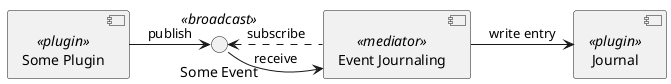

# Messaging

Messaging comes in two different flavors:

- Peer-to-peer (P2P)
- Broadcast

Peer-to-peer messaging is bidirectional while broadcast messaging is strictly unidirectional.

## Peer-to-peer (P2P)

Peer-to-peer messaging follows a request/response style. It involves *multiple producers* that send requests to a *single consumer*. The consumer receives and processes requests. It sends a response or reply back to the same producer from which it has sent the request.

Plugins receive requests in form of *commands*  and *queries*. Queries are supposed to be idempotent, i.e. neither do they affect the state of the plugin nor do they have any other, observable side effects. Commands may do not provide any of those guarantees. In contrast to the strict separation between commands and queries in a CQRS architecture both request types may have a response.

All requests are processed sequentially one after another, i.e. message processing is not interrupted. Plugins may spawn additional *tasks* internally to allow the execution of long running, concurrent operations.

## Broadcast

Plugins notify other plugins or components by sending messages to broadcast channels. Each plugin provides at least one event channel for publishing information about the lifecycle, use case specific notifications, or notable incidents.

Listeners receive broadcast messages by subscribing to the corresponding channel. Subscriptions might either be permanent or temporary depending on the use case.

Broadcast channels have a limited capacity and slow receivers might miss messages if they are not able to keep up with the frequency of the publisher.

### Event Dispatch

Plugins shall not receive and process events from other plugins directly. Instead intermediate *mediators* are installed in between the plugins that receive events from one plugin and transform them into commands for another plugin. Those mediators are implemented as lightweight, asynchronous tasks.

**Example**:
On startup the broadcast event channel of each plugin is wired with an asynchronous task that is responsible for recording selected events in the journal. Those mediators know how to filter and transform received events into journal entries and send commands for writing those entries to the *Journal* plugin.

